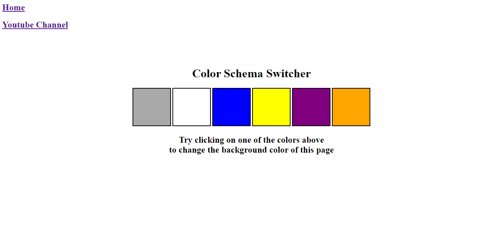

<h1>Color Scheme Switcher</h1>

This project is a simple color scheme switcher application built using HTML, CSS, and JavaScript. It allows users to change the background color of the page by clicking on different color options.

<h2>Features:</h2>
Switch between different color schemes by clicking on color options.
Dynamically change the background color of the page.

<h2>Technologies Used:</h2>
HTML
CSS
JavaScript

<h2>How to Use:</h2>
Clone or download the project repository to your local machine.
Open the index.html file in your web browser.
Click on one of the color options above to change the background color of the page.

<h2>Screenshots:</h2>

